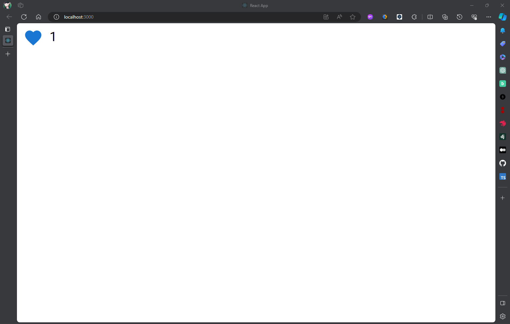

# react-mui-tutorial

本プロジェクトは、ReactとJavaScript、MUIを用いて簡単なSNSのいいねボタンを表示するアプリケーションである。

# 開発手順

予めNode.jsをインストールしていることを前提に解説する。

## (1) Reactアプリケーションの作成

以下のコマンドを入力してReactアプリケーションを新しく作る。

```bash
npx create-react-app sns-like-button
```

インストールが終了したら、以下のコマンドを入力して該当のフォルダに移動する。

```bash
cd sns-like-button
```

## (2) 必要なパッケージのインストール

以下のコマンドを入力する。

```bash
npm install @mui/icons-material @mui/material @emotion/styled @emotion/react
```

## (3) いいねボタンの作成

`src/LikeButton.js`を新規で作成して、以下のように書く。

```js
// (1) 必要なパッケージのインストール
import React, { useState } from 'react';
import { IconButton, Typography } from '@mui/material';
import FavoriteIcon from '@mui/icons-material/Favorite';

// (2) いいねボタンをuseStateを用いて作る
const LikeButton = () => {
  const [liked, setLiked] = useState(false);
  const [likesCount, setLikesCount] = useState(0);

  // (3) いいねボタンの数を表示する
  const toggleLike = () => {
    setLiked(!liked);
    setLikesCount(liked ? likesCount - 1 : likesCount + 1);
  };

  // (4) いいねボタンが表示される
  return (
    <div>
      <IconButton onClick={toggleLike} color={liked ? 'primary' : 'default'}>
        <FavoriteIcon />
      </IconButton>
      <Typography component="span">{likesCount}</Typography>
    </div>
  );
};

export default LikeButton;
```

## (4) `src/App.js`の修正

`src/App.js`を以下のように修正し、いいねボタンだけが表示されるように書き換える。

```js
import React from 'react';
import LikeButton from './LikeButton';

function App() {
  return (
    <div className="App">
      <LikeButton />
    </div>
  );
}

export default App;
```

## (5) 開発用サーバの立ち上げ

以下のコマンドを入力すると、いいねボタンが表示される。

```bash
npm start
```

